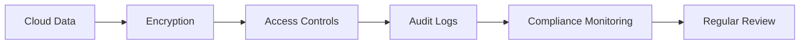
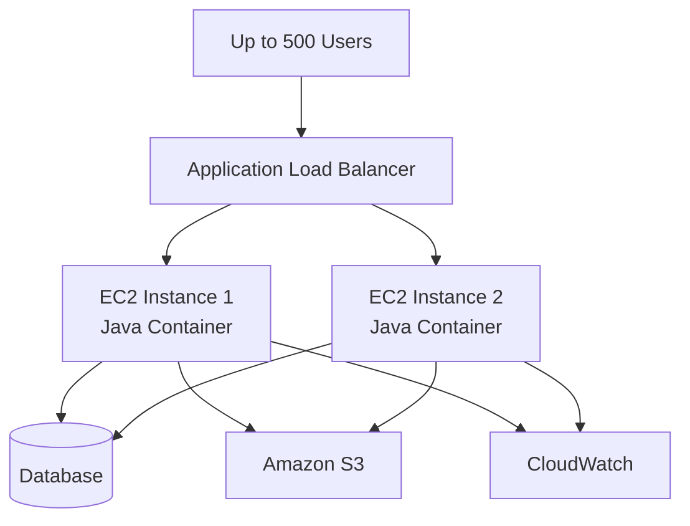

# AWS Critical Thinking Questions

## Introduction to Cloud Computing Concepts

**Name:** Samuel Adesanya
**Project:** Introduction to Cloud Computing - AWS
**Topic:** AWS Critical Thinking Questions
**Date:** August 2026

---

# 1. What is Cloud Computing?

Cloud computing is the use of computing resources such as servers, storage, databases, networking, applications, and other services over a network, usually the internet, instead of having to own and maintain all the physical hardware ourselves. According to the National Institute of Standards and Technology (NIST), cloud computing provides convenient, on-demand access to a shared pool of configurable computing resources that can be rapidly provisioned and released (Mell & Grance, 2011).

For example, instead of buying a physical server and keeping it in an office, a company can use **Amazon EC2** to create a virtual server in the AWS cloud.

### Basic Characteristics of Cloud Computing

Some important characteristics of cloud computing include:

* **On-demand access:** Resources can be created whenever they are needed.
* **Scalability:** Resources can be increased or decreased depending on demand.
* **Pay-as-you-go:** Users can pay for the resources they use.
* **Resource sharing:** Cloud providers use shared pools of computing resources to serve multiple customers.
* **Rapid elasticity:** Computing resources can be provisioned and released quickly when requirements change.
* **Broad network access:** Cloud resources can be accessed through networks using different types of devices (Mell & Grance, 2011).

### Cloud vs Traditional On-Premise Infrastructure

| Cloud Computing                                | On-Premise Computing                          |
| ---------------------------------------------- | --------------------------------------------- |
| Infrastructure is provided by a cloud provider | Company owns the physical infrastructure      |
| Usually pay for what is used                   | Large upfront hardware costs                  |
| Can scale quickly                              | Scaling requires purchasing hardware          |
| Provider manages much of the infrastructure    | Company manages the infrastructure            |
| Can deploy resources quickly                   | Hardware installation can take time           |
| Easy to create resources in different regions  | Physical infrastructure is location dependent |

Cloud computing therefore makes it easier for organizations to start and scale applications without purchasing large amounts of physical hardware. Rapid provisioning and resource elasticity are some of the main characteristics that distinguish cloud computing from traditional infrastructure (Mell & Grance, 2011).

---

# 2. Types of Cloud Computing Services

There are three major cloud service models: **Infrastructure as a Service (IaaS), Platform as a Service (PaaS), and Software as a Service (SaaS)**. These service models describe the different levels of infrastructure and software management provided by the cloud provider (Mell & Grance, 2011).

## Infrastructure as a Service (IaaS)

IaaS provides basic computing infrastructure such as virtual machines, storage, and networking.

### Example

**Amazon EC2** is an example of an infrastructure service that provides scalable computing capacity.

A company can create an EC2 instance and install its own operating system, applications, and other software.

### Use Case

IaaS is useful when an organization wants more control over the operating system, applications, and infrastructure configuration (Mell & Grance, 2011).

---

## Platform as a Service (PaaS)

PaaS provides a platform where developers can build and deploy applications without managing much of the underlying infrastructure.

### Example

**AWS Elastic Beanstalk** is an AWS service that simplifies application deployment and infrastructure management.

### Use Case

A developer can upload an application and allow the platform to handle many infrastructure tasks associated with deployment and scaling. PaaS allows developers to focus more on their applications instead of managing the underlying infrastructure (Mell & Grance, 2011).

---

## Software as a Service (SaaS)

SaaS provides complete software applications through the internet.

### Examples

Examples include:

* Gmail
* Microsoft 365
* Salesforce

The user normally does not need to manage the servers or operating system behind the application.

### Comparison

| Model | What the Customer Manages         | Example               |
| ----- | --------------------------------- | --------------------- |
| IaaS  | OS, applications, configurations  | Amazon EC2            |
| PaaS  | Application and data              | AWS Elastic Beanstalk |
| SaaS  | Mainly application usage and data | Salesforce            |

The major difference between these models is the amount of infrastructure management handled by the cloud provider. IaaS provides the customer with the greatest infrastructure control, while SaaS provides the least (Mell & Grance, 2011).

---

# 3. Cloud Deployment Models

Cloud deployment models describe how cloud infrastructure is organized and who has access to it. NIST identifies public, private, community, and hybrid cloud deployment models (Mell & Grance, 2011).

## Public Cloud

A public cloud is infrastructure operated by a cloud provider and made available to multiple customers.

### Example

**Amazon Web Services (AWS)** is an example of a public cloud provider.

### Use Cases

Public cloud is useful for:

* Startups
* Websites
* Development environments
* Applications that need rapid scaling
* Businesses that do not want to purchase physical servers

---

## Private Cloud

A private cloud is dedicated to one organization.

It can be hosted inside the organization's own data center or by a third-party provider.

### Use Cases

Private cloud can be useful for organizations that need:

* Greater control
* Specific security requirements
* Strict compliance requirements
* Dedicated infrastructure

According to NIST, a private cloud is provisioned for the exclusive use of a single organization (Mell & Grance, 2011).

---

## Hybrid Cloud

Hybrid cloud combines private infrastructure with public cloud services.

For example, a company could keep sensitive databases in its private environment while running its web application in AWS.

### Use Case

Hybrid cloud can be useful when an organization wants to gradually move to the cloud while keeping some existing infrastructure.

### Comparison

| Model   | Description                       | Example Use                       |
| ------- | --------------------------------- | --------------------------------- |
| Public  | Shared provider infrastructure    | Startup application               |
| Private | Dedicated to one organization     | Highly controlled environment     |
| Hybrid  | Combination of public and private | Existing company migrating to AWS |

The choice of deployment model depends on factors such as security, compliance, infrastructure requirements, and the organization's business needs (Mell & Grance, 2011).

---

# 4. Benefits of Cloud Computing

Cloud computing provides several advantages compared with traditional data centers. NIST identifies rapid provisioning and elasticity as important characteristics of cloud computing, which can support faster deployment and flexible resource usage (Mell & Grance, 2011).

## 1. Cost Reduction

Organizations do not necessarily need to purchase expensive physical servers before starting a project.

They can rent computing resources and pay for the resources they use. However, cloud costs still need to be monitored because inefficient resource usage can increase expenses.

AWS recommends continuously reviewing workloads and using resources efficiently as part of cost optimization (Amazon Web Services, 2024).

## 2. Scalability

Cloud infrastructure can scale when demand increases.

For example, an online store may increase its computing capacity during a major sales event and reduce it after the event.

AWS recommends designing reliable workloads that can dynamically acquire computing resources when demand changes (Amazon Web Services, 2026).

## 3. Faster Deployment

A cloud server can be created quickly instead of waiting for physical hardware to be purchased, delivered, installed, and configured.

Rapid provisioning is one of the characteristics of cloud computing identified by NIST (Mell & Grance, 2011).

## 4. Reliability

Cloud applications can use redundant resources and multiple Availability Zones to reduce the impact of infrastructure failures.

AWS identifies resiliency and recovery from infrastructure or service disruptions as important parts of cloud reliability (Amazon Web Services, 2026).

## 5. Global Availability

Cloud providers operate infrastructure in different geographical locations. This allows organizations to deploy applications in locations that are appropriate for their users and requirements.

## 6. Flexibility

Developers can quickly create, test, modify, and remove resources without purchasing new physical equipment.

This flexibility is supported by the rapid provisioning and release of cloud resources described by NIST (Mell & Grance, 2011).

---

# 5. Concerns Around Cloud Computing

Although cloud computing has many benefits, there are also risks and challenges that organizations need to consider.

## Data Security

Organizations need to protect their data from unauthorized access.

Security measures can include:

* Encryption
* Strong passwords
* Multi-factor authentication
* IAM policies
* Network security controls

AWS recommends protecting credentials, using MFA, encrypting data, and using access controls to protect AWS environments (Amazon Web Services, 2026).

## Compliance

Organizations may need to follow regulations depending on the type of data they store.

For example, companies handling financial, healthcare, or personal information may have additional regulatory requirements.

Cloud customers are still responsible for understanding their compliance obligations and configuring their environments appropriately.

## Vendor Lock-In

Vendor lock-in occurs when an organization becomes heavily dependent on one cloud provider.

Moving applications and data to another provider can then become expensive or difficult.

One way to reduce this risk is to use portable technologies such as containers and open standards where appropriate.

## Downtime

Cloud providers have highly available infrastructure, but outages and other disruptions can still occur.

Organizations should therefore design applications with redundancy, backups, monitoring, and disaster recovery plans. AWS recommends defining recovery objectives, implementing recovery strategies, and testing disaster recovery arrangements (Amazon Web Services, 2026).

---

# 6. Basic Cloud Architecture

A simple AWS architecture can contain:

* **Amazon VPC** – Provides the network environment.
* **Amazon EC2** – Runs the application.
* **Amazon S3** – Stores files and objects.

These services can be combined to provide networking, computing, and storage for an application.

### Basic Architecture

### How the Services Interact

A user sends a request through the internet to an application running on an EC2 instance.

The EC2 instance operates inside an AWS VPC, which provides the networking environment for the application.

If the application needs to store files such as images, documents, or backups, it can store them in Amazon S3.

### Simple Flow

**User → Internet → VPC → EC2 → S3**

This architecture separates computing, networking, and storage responsibilities.

### Screenshot

**[INSERT SCREENSHOT HERE]**

Suggested screenshot: AWS Management Console showing the EC2 instance, VPC, or S3 bucket used in the project.

---

# 7. Explanation of Important Cloud Terms

## Fault Tolerance

Fault tolerance is the ability of a system to continue operating when one or more components fail.

### Example

An application running across multiple servers can continue working if one server stops responding.

Designing systems with redundancy and recovery mechanisms helps reduce the effect of failures (Amazon Web Services, 2026).

---

## High Availability

High availability means designing a system so that it remains accessible and operational for most of the time.

### Example

An application can run across multiple Availability Zones so that failure in one zone does not necessarily stop the entire application.

AWS recommends designing workloads to meet availability targets and to reduce single points of failure (Amazon Web Services, 2026).

---

## Scalability

Scalability is the ability of a system to handle increased workload by adding or adjusting resources.

### Example

An application may use additional EC2 instances when the number of users increases.

Cloud computing supports rapid elasticity, allowing resources to be provisioned and released as requirements change (Mell & Grance, 2011).

---

## Cost Optimization

Cost optimization means using cloud resources efficiently while avoiding unnecessary spending.

### Examples

* Removing unused resources
* Right-sizing EC2 instances
* Using appropriate storage classes
* Monitoring AWS costs
* Using AWS Pricing Calculator
* Applying resource tags

AWS describes cost optimization as a continuous process of improving resource usage while achieving business outcomes at an appropriate cost (Amazon Web Services, 2024).

---

## Serverless Computing

Serverless computing allows developers to run application code without managing traditional servers directly.

### Example

**AWS Lambda** allows developers to execute code in response to events without directly managing servers.

Serverless computing can be useful for applications that have variable or event-driven workloads.

---

# 8. Compliance Considerations in Cloud Computing

Compliance is important because organizations must protect data and follow applicable laws, regulations, and industry requirements.

The exact requirements depend on the organization's location, industry, and type of information being processed.

Organizations should understand which security and compliance responsibilities belong to them and which are handled by the cloud provider.

## Data Encryption

Sensitive information should be protected using encryption.

Encryption can be used:

* **At rest** – Protecting stored data.
* **In transit** – Protecting data while it moves across networks.

AWS recommends using encryption solutions and security controls to protect data in AWS environments (Amazon Web Services, 2026).

AWS Key Management Service (KMS) can also be used to manage encryption keys. For example, AWS CloudTrail logs can be encrypted using AWS KMS keys (Amazon Web Services, 2026).

## Access Controls

Organizations should make sure that users only have access to the resources they need.

AWS Identity and Access Management (IAM) can be used to control permissions.

The principle of **least privilege** should be followed. This means a user should receive only the permissions necessary to perform their job. AWS recommends granting only the minimum permissions required for a task (Amazon Web Services, 2026).

## Audit Trails

Organizations need to keep records of important activities.

For example, AWS CloudTrail can record API activity and help organizations investigate security and operational events. CloudTrail provides audit information that can support governance, compliance, and risk management (Amazon Web Services, 2026).

## Compliance Monitoring

Organizations should regularly monitor their cloud environments to identify configuration problems and compliance issues.

Possible activities include:

* Reviewing IAM permissions
* Monitoring logs
* Checking encryption settings
* Reviewing security configurations
* Auditing access
* Monitoring AWS resources

AWS recommends continuous review and monitoring as part of maintaining secure and well-architected cloud workloads (Amazon Web Services, 2026).

### Compliance Process

Compliance should be treated as an ongoing process rather than something performed only once.

---

# 9. Choosing Between Cloud and On-Premise Computing for a Java Containerized Application

## My Decision

For a Java containerized application expected to serve approximately **500 users during peak periods**, I would choose **cloud computing**, specifically AWS.

The main reason is that AWS provides flexibility, scalability, reliability, and managed services that can reduce the amount of infrastructure that needs to be managed manually.

The AWS Well-Architected Framework recommends considering factors such as security, reliability, performance efficiency, cost optimization, operational excellence, and sustainability when designing cloud workloads (Amazon Web Services, 2026).

---

## Scalability

The application may not have the same number of users throughout the day.

For example, it could have 100 users normally and 500 users during peak periods.

Using AWS, additional application containers or EC2 instances can be added when demand increases.

This is more flexible than purchasing physical servers that may remain underused during normal periods.

Cloud elasticity allows resources to be adjusted as workload requirements change (Mell & Grance, 2011).

---

## Cost

With on-premise infrastructure, the organization would need to purchase:

* Physical servers
* Networking equipment
* Storage
* Backup equipment
* Power systems
* Cooling systems

There would also be maintenance costs.

With AWS, the organization can start with smaller resources and scale them as needed.

However, cloud costs still need to be monitored carefully because poorly managed resources can become expensive. AWS recommends regularly reviewing workloads and improving resource cost-effectiveness (Amazon Web Services, 2024).

---

## Flexibility

Containers make it easier to package the Java application and its dependencies.

For example, the Java application can be packaged into a Docker container.

The container can then be deployed to AWS infrastructure.

This makes development, testing, and deployment more consistent.

---

## Reliability

AWS provides multiple Availability Zones within regions.

The application can be deployed across multiple Availability Zones to reduce the impact of a single infrastructure failure.

A load balancer can distribute traffic between healthy application instances.

Using redundant resources and designing for recovery can improve the resilience of a workload (Amazon Web Services, 2026).

---

# Proposed Architecture for 500 Peak Users

A basic architecture could look like this:

## Architecture Explanation

### 1. Users

Approximately 500 users access the Java application during the peak period.

### 2. Application Load Balancer

The Application Load Balancer receives incoming requests and distributes them between the available application instances.

Using multiple application instances behind a load balancer can help distribute workload and improve application resilience.

### 3. EC2 Instances

Two or more EC2 instances can run the Java application inside containers.

Having multiple instances provides redundancy and allows traffic to continue being served if one instance becomes unavailable.

### 4. Database

The Java application communicates with a database to store application data.

For a production system, a managed database service such as Amazon RDS could be considered.

### 5. Amazon S3

S3 can be used for objects such as:

* Images
* Documents
* Backups
* Application files

### 6. Amazon CloudWatch

CloudWatch can be used to monitor application and infrastructure metrics and generate alarms when problems occur.

Monitoring helps organizations identify issues and respond to changes in workload requirements.

---

# Cloud vs On-Premise Decision

| Factor           | Cloud                                          | On-Premise                                        |
| ---------------- | ---------------------------------------------- | ------------------------------------------------- |
| Initial Cost     | Lower                                          | Higher                                            |
| Scalability      | Very flexible                                  | Requires additional hardware                      |
| Deployment Speed | Fast                                           | Slower                                            |
| Maintenance      | Less physical infrastructure to manage         | Organization manages hardware                     |
| Reliability      | Can use multiple Availability Zones            | Requires additional infrastructure for redundancy |
| Flexibility      | High                                           | Lower                                             |
| Global Access    | Easy to deploy globally                        | More difficult                                    |
| Cost Management  | Pay for resources used, but must monitor usage | Large upfront investment                          |

Based on these factors, I would select **AWS cloud infrastructure** for the Java containerized application.

My decision is mainly based on scalability, flexibility, reliability, and the ability to adjust resources as demand changes. These considerations are consistent with AWS Well-Architected guidance, which emphasizes reliability, performance efficiency, cost optimization, and other architectural principles (Amazon Web Services, 2026).

---

# Conclusion

Cloud computing provides organizations with flexible access to computing resources without requiring them to own all the physical infrastructure.

AWS provides services such as EC2 for computing, S3 for object storage, VPC for networking, IAM for access control, and CloudWatch for monitoring.

For the Java containerized application, I would use AWS because it provides better scalability and flexibility for handling peak traffic of around 500 users. Using multiple application instances behind a load balancer can also improve reliability.

However, cloud computing still requires proper security, cost management, monitoring, backup, and compliance practices.

Overall, the cloud would be my preferred option because it allows the application infrastructure to grow with the application's requirements while reducing the need for large upfront hardware investments. The decision also follows the general principles of designing secure, reliable, efficient, and cost-effective cloud workloads (Amazon Web Services, 2026).

---

# Screenshots

Add screenshots of the AWS resources used during the practical part of the project.

## Screenshot 1 – AWS Console

**[INSERT SCREENSHOT HERE]**

Description: AWS Management Console showing the relevant AWS resources.

## Screenshot 2 – EC2

**[INSERT SCREENSHOT HERE]**

Description: EC2 instance running the application or container.

## Screenshot 3 – S3

**[INSERT SCREENSHOT HERE]**

Description: S3 bucket used for object storage.

## Screenshot 4 – VPC

**[INSERT SCREENSHOT HERE]**

Description: VPC and networking configuration.

## Screenshot 5 – AWS Pricing Calculator

---

# Technologies and AWS Services Used

* Amazon Web Services (AWS)
* Amazon EC2
* Amazon S3
* Amazon VPC
* AWS IAM
* Amazon CloudWatch
* AWS Application Load Balancer
* Amazon RDS
* Docker
* Java

---

# Final Summary

This project helped me understand the basic concepts of cloud computing and how AWS services can be combined to build reliable applications.

I learned about IaaS, PaaS, SaaS, public, private and hybrid clouds, as well as important concepts such as scalability, high availability, fault tolerance, cost optimization, serverless computing, and compliance.

I also learned why cloud infrastructure can be a good choice for a containerized Java application that needs to support approximately 500 users during peak periods.

---

# References

Amazon Web Services. (2024). *AWS Well-Architected Framework: Cost optimization pillar*. AWS Documentation. https://docs.aws.amazon.com/wellarchitected/latest/cost-optimization-pillar/welcome.html

Amazon Web Services. (2026). *AWS Well-Architected Framework: Reliability pillar*. AWS Documentation. https://docs.aws.amazon.com/wellarchitected/latest/reliability-pillar/welcome.html

Amazon Web Services. (2026). *Data protection in AWS Identity and Access Management*. AWS Documentation. https://docs.aws.amazon.com/IAM/latest/UserGuide/data-protection.html

Amazon Web Services. (2026). *Security best practices in AWS CloudTrail*. AWS Documentation. https://docs.aws.amazon.com/awscloudtrail/latest/userguide/best-practices-security.html

Amazon Web Services. (2026). *Least-privilege permissions*. AWS Key Management Service Documentation. https://docs.aws.amazon.com/kms/latest/developerguide/least-privilege.html

Mell, P., & Grance, T. (2011). *The NIST definition of cloud computing* (NIST Special Publication 800-145). National Institute of Standards and Technology. https://doi.org/10.6028/NIST.SP.800-145
